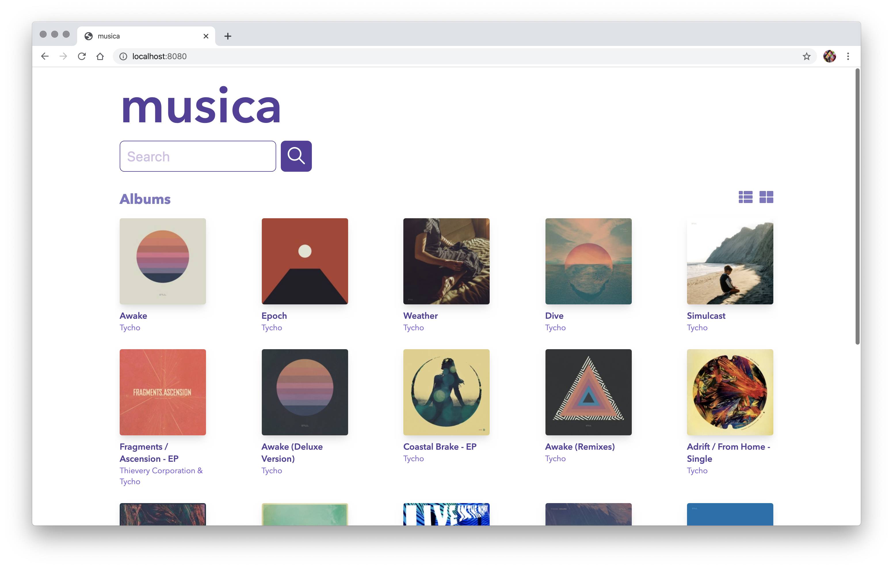

# musica

musica is an app that allows you to search iTunes for music and view albums as the results.

## 👀 Preview

https://musica-app.netlify.com/



## 🚀 Quick start

1. Download the project and cd into it:

   ```bash
   git clone https://github.com/junagao/musica.git
   cd musica
   ```

2. Install dependencies and run the application:

   ```bash
   yarn
   yarn dev
   ```

3. Open your browser and navigate to:

   http://localhost:8080/

## 📚 Tech Stack

- React 16
- Redux
  - Redux Dev Tools
  - Redux Thunk
- Webpack 4
- Babel 7
- Hot Module Replacement
- ESLint (airbnb styleguide)
- Prettier
- Husky
- lint-staged
- axios
- Jest
- Enzyme

## Author

Juliane Nagao - [GitHub](https://github.com/junagao) - [LinkedIn](https://www.linkedin.com/in/junagao/)

## License

This project is licensed under the MIT License.
